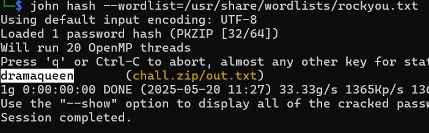
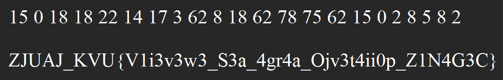
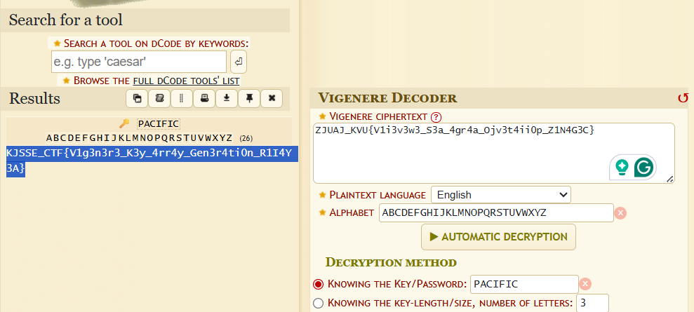

# Gringotts Vault Code

**Description**: How will you uncover what’s been locked away.

**File 1**: [chall.py](./files/chall.py)  
**File 2**: [chall.zip](./files/chall.zip)  

## Solution
### Step 1: Using zip2john crack the password for the zip file

### Step 2: Unzip the file using the password, upon unzipping we get a file called `out.txt` which has some numbers and the encrypted flag.

### Step 3: The numbers in the `out.txt` as the indexes and plot them in a list given in the `chall.py` file.

```
a = ['A', 'B', 'C', 'D', 'E', 'F', 'G', 'H', 'I', 'J', 'K', 'L', 'M', 'N', 'O', 'P', 'Q', 'R', 'S', 'T', 'U', 'V', 'W', 'X', 'Y', 'Z', 'a', 'b', 'c', 'd', 'e', 'f', 'g', 'h', 'i', 'j', 'k', 'l', 'm', 'n', 'o', 'p', 'q', 'r', 's', 't', 'u', 'v', 'w', 'x', 'y', 'z', '0', '1', '2', '3', '4', '5', '6', '7', '8', '9', ' ', '!', '"', '#', '$', '%', '&', "'", '(', ')', '*', '+', ',', '-', '.', '/', ':', ';', '<', '=', '>', '?', '@', '[', ']', '^', '_', '`', '{', '|', '}', '~']

indexes = [15, 0, 18, 18, 22, 14, 17, 3, 62, 8, 18, 62, 78, 75, 62, 15, 0, 2, 8, 5, 8, 2]

result = ''.join([a[i] for i in indexes])

print(result)
```

### Text extracted:-
```
PASSWORD IS :- PACIFIC
```
### Step 4: Using the password `PACIFIC`, decrypt the flag using [Vigenere Cipher](https://www.dcode.fr/vigenere-cipher).



# Flag:
```
KJSSE_CTF{V1g3n3r3_K3y_4rr4y_Gen3r4ti0n_R1I4Y3A}
```