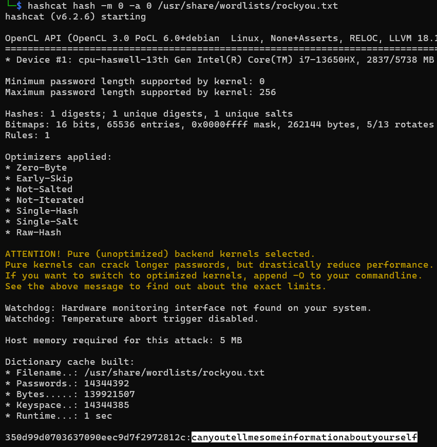

# HEX :)

**Description**: `350d99d0703637090eec9d7f2972812c`
 

## Solution
### Step 1: This is not a hex string, it is MD5 hash.
### Step 2: Crack the hash using `Hashcat`.
command: (save the hash in a file called `hash`)
```
hashcat hash -m 0 -a 0 /usr/share/wordlists/rockyou.txt
```


# Flag:
```
KJSSE_CTF{canyoutellmesomeinformationaboutyourself}
```