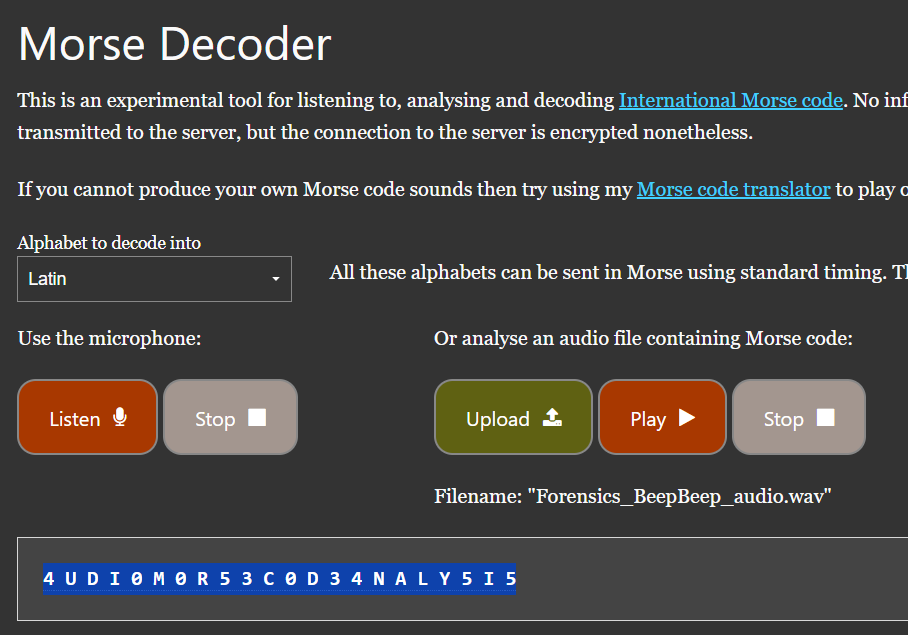

# BeepBeep

**Description**: BeepBeep!!!

**File 1**: [Forensics_BeepBeep_audio.wav](./files/Forensics_BeepBeep_audio.wav)

## Solution
### Step 1: Use [Audio Morse Code Decoder](https://morsecode.world/international/decoder/audio-decoder-adaptive.html) to get the flag from this audio file.



# Flag:
```
KJSSE_CTF{4UDI0M0R53C0D34NALY5I5}
```