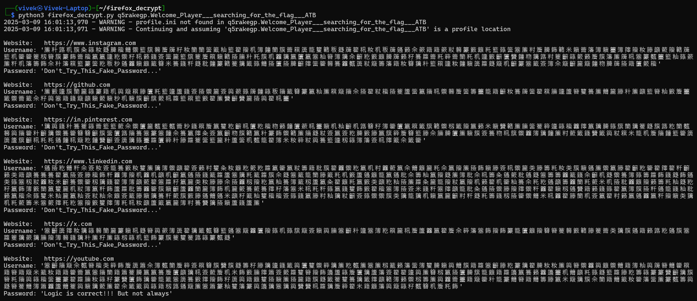
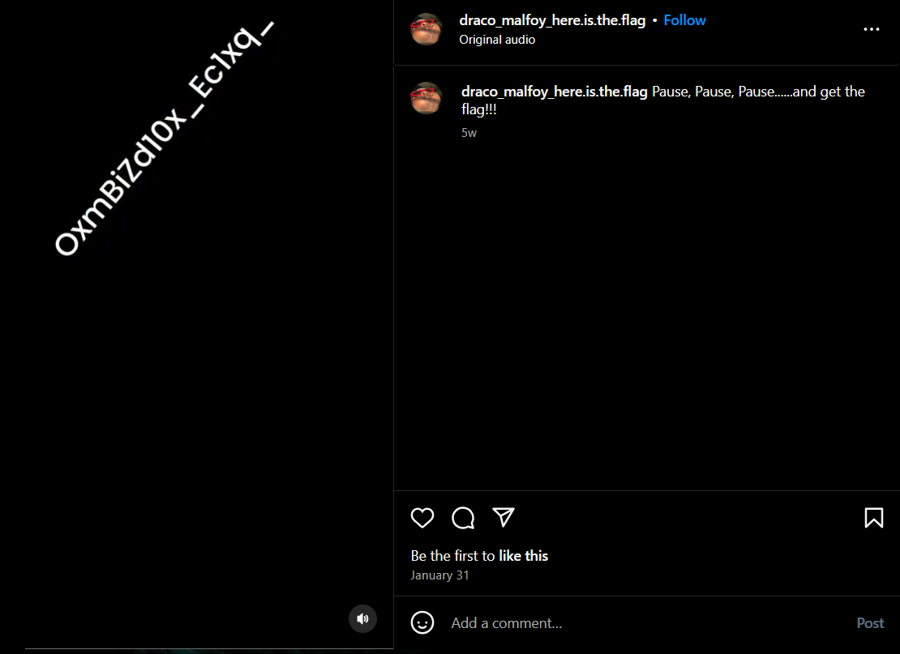
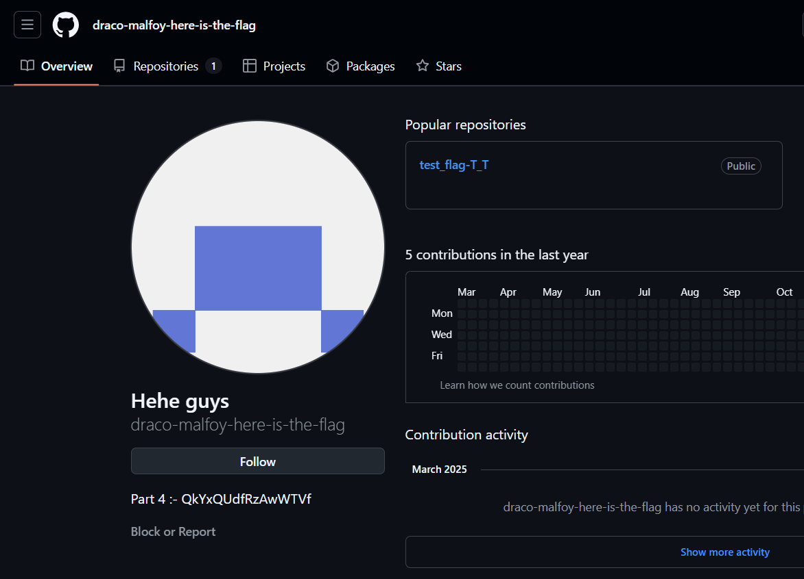
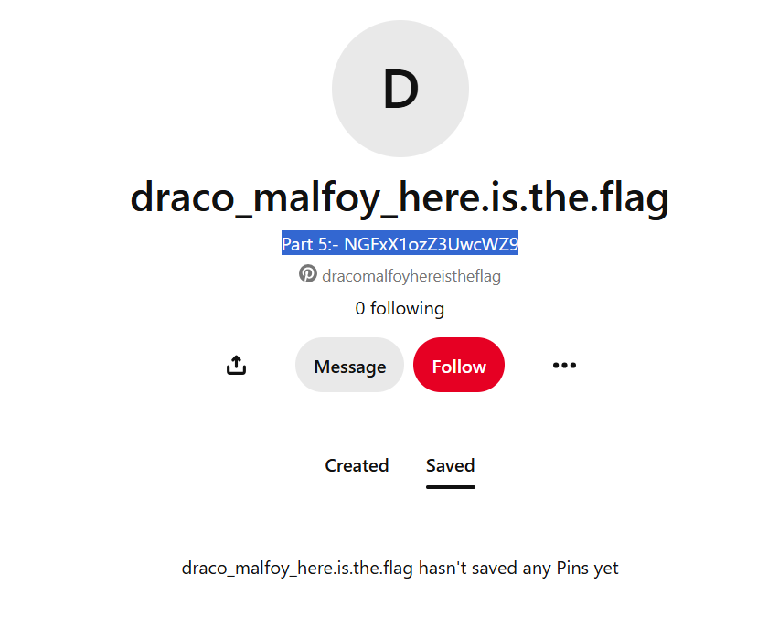
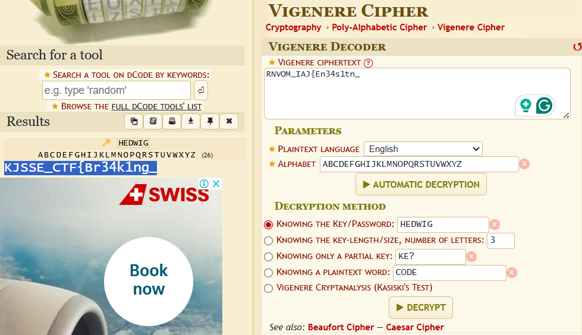

# Destroy the FOX

**Description**: A forgotten archive holds hidden memories, but unlocking them won’t be easy. Piece together the fragments and uncover the long-buried secret—if you have the patience and skill to endure the challenge.

Note:- In case of any errors when unzipping the file, press skip all files.

**File 1**: [Firefox-profile Challenge File](./files/q5rakegp.Welcome_Player___searching_for_the_flag___ATB-20241213T170017Z-001.zip)<br>

# Solution
### Step 1:- Extract the contents of [Firefox-profile Challenge File](./files/q5rakegp.Welcome_Player___searching_for_the_flag___ATB-20241213T170017Z-001.zip).

### Step 2:- Use [firefox-decrypt](https://github.com/unode/firefox_decrypt) tool to decrypt the key3.db and logins.json files.


Decrypted Content:
```
Website:   https://www.instagram.com
Username: '簾籵簬籶籏粂簶籹籎簲籕籋籞籃簱簭簷簰籽籹籣籣簹籖籼籃籊籀籶簿籦籣籏籥簯簴籠籰簵粄籎簰籊籸籹籶粄簰簻籁籴籨籍籍籨粀簭籇籔籬籷籃籙簹簺簾籿簷簲籂簵米籟籥籓簿籟籉簿籜籀籹籐籲籢籀簵簰 籃籶籗籗籆籾簪籏籇籂籥籕籯籯籧籺籞籽籸籁籛簽簹籭籃簱籆簷簯籟簵籡籘籵籷籏籶籱簼籝籄籯簺籼簪簿簼籴籪籺籔籬簲簰籁籽籑籮籥籷簳籥籣籷籶籧籔籪籄籫籦粅簼簬籿籆籪簶籢籁簷籏籓簾簰籸簺籇籈籉籃籼籙籨簾粁籶籓籌籂籴籵籓簯籃籇簹籺粄粆簻籱籟籬籖簮米籑籛粁籎粃籦籇簵籆簼籤籙籋籡籄籡簲籪籜簹籗簭籑籱籈簴粀簸籌籓籍籹簮簼籵籃簯籧籹籦籟簴籮籎簸籶籪籇簺籖簽簿籴簸籪籭簸籦粅簲簰籡籍籄籢籕'
Password: 'Don't_Try_This_Fake_Password...'

Website:   https://github.com
Username: '簾籔籧籏籣籭簶籇籍籶籅簸簯籐籄籷籃籧籚籛簽籡籞籭簽籅籨籙簰籦簶粄籒籖簮籇籯籼簾簯簸籒籴籡籊粀籕籡籆籚簹籯籒籸籞簭簷簹籌籉籠籍籪籹籑簰簹籊簯籘籧籚簪籰籑簾籋籭籐籵簾籲籃簪籼籔簷籉 籤籞籥籖籴籽籅簺籍籛簸籲籟籢籟粆籶籟籏籪簱籢籸籮籃簯籃籔籊簾籫籪籫籭籡籅籊籸籉'
Password: 'Don't_Try_This_Fake_Password...'

Website:   https://in.pinterest.com
Username: '簼籅籛籵籑籆簶籥籃籃籢籴籞籄籭籈籃籈籥粆籛簯簷籝籰籺籪籸籄籺籕粅籁籦籄籨籸籉籟籶籼籪籶簬簮籽簿籗籄籯簯籤簱簵籞籾籤籀籝籁米籟籫簵簾籘簹籆簳籧簶籕籱籜籝簼簲籙簱籣簼籆籎籏簬籺籣籈 簭籅籒籗籵籪簼籞籑籗簮簮籪籏簹籄簬籒籑簺籇簺籦籴籑籯籜粂簽籝籪粅籏簵籝籵籇籂籞簵簾籒籎粀簽籝簽籺簲籔籐籝簱簳簷簮籃籐籴籘簲籄簾籟籏簽籑粅籸簱籞籱簿簼籦簾籿籢籤籛籫籤籅粀簯米籠籶簷籒籦籃籗簴簴籚簱籪籸籷籷簻籦籸簸籺籦籫籪簽簴簼籙籉籮籄簳籵籐籮籆簹籃籭籵籚簹籶籈籠籊簿米籹簳粀籅籑籃籧籾簶簿籓簽籸籜籖籴籤籗'
Password: 'Don't_Try_This_Fake_Password...'

Website:   https://www.linkedin.com
Username: '簻籡籺籋粁籴簽籹簽籠籑籔籹籰簾簼簿籞籲籊簽籁籿籰粂籹籬籺籢籺籮籯籗籝粀籌籍粃籏籊籱籞籺籯籶籿籱籢籝籴籋籬籭籷籴籝籀簾籡籂籟籐簽籸籞籭类籐籌籷籹类籏籟簻簾籞籯籐籊籪籺籗籊籜籊粁籪 籁类籍籲籑籑籑籊籯籡簽籐籕籂粁籱簿籀籶籱籶籲籶籪籯簻籡籛籖籮籚簺簼籷籖籮籏籴籎簺籖籠籣籐籖籷籶籔籚簻籬籠籝簻粃籴籌籼籝籀籎簾簿粃籴籸籌粂簻籢粃簻籎簺籌籌籱籖籛籴籪籶籎籞籑簿籙籌籮籂籛籎籂簻类籙簺籾粀籱籹米籪籑籞籗籾簼籛籊簿簿籲籢籊簺籮籽籯籭类籹籐籐籴籡籱籾籀籺籝籼籑簿籖籾籚籯粂籊籬籷籝籔类籲籺籼籡簾籮粂籭籠籀粀籯籀籶籁籊籶籗籼籑籴籷籺簻籲籌籱籣籷籢米籶籡粃籱籬籀籁籌籷籼籎籺籽籯籂簿籔籣籝籰籭籶粀簿籝粁籂籚籮粃籌籱籗籏籟籪籚籱籣籭簿籂籶籭籢籑籢籑籜籽籓簺米籸籷粁籙籝籛籰籂籔籊籕簺簿籡簽米籛粁簺籜籲籠粃粂簻籡籞籐籀籜籞粁籱籊籟籾簻籫籍籁籛籙籊籝簿籏籡粁簻籠籛籼粃籁籝籕籴籙籰米籼籭籯籼簽粀籼籴籬簽籖籐籟簼籑粁籢籏籔籐簻籋簻米籲籽籖籼籰籕籕簽籙籛籯籐籿籼簼粀籪簽籙籞籞籏类簼籠簼籶籟籝籭籪籿粁籎籷籌籛籾籡籗籞籋米籸籱籊籐籣籶簽籯籊籿籁籝簻籱籝粁籀籟类簼籶籷籢籌米簺籢籜籷籺簺籀籔籰籜簿籷籸籹籲籚籖籯籭簿籿籑籫簼籡籟籚籛籚簾'
Password: 'Don't_Try_This_Fake_Password...'

Website:   https://x.com
Username: '簺籪簴籜籹簼簶簭籣籭籇籟籸籎簪籅籨簿簴籊簼籤籈簮籃簻簺簸籱籄籀籙籶籙簱簸簽籟籅籘簺籪籵籧簺簿籺簯籭籸簷籚籱籝籊簷籴簳籓簺籂籀籂籇籠籄籬籀簮簪籆簭籔簵籐籆籥类簼籏簻籍籁簬籺簻籏簺 籮籆簼籨簼籘籀簿簭籛簼籵簾籽簾簶籾簶籶籃籂籇籏籆籰籆簬簶籇籈籎'
Password: 'Don't_Try_This_Fake_Password...'

Website:   https://youtube.com
Username: '簺籪籒簸籴籈簪籕类簳籂簷簴簫籴簿籈籣簷簳簽簯簮籏籫籏籎籌籽籐簼籧籛籤籅籄籰籞簳簼簾籺籈簾簺簾籾籖籁籓簹簿籰簲籟籅籋籏籍籮簺籪籐籺籇簼籊簲籹籹簾籅簪籞籱籅籬籞籋籍簿籼籅簰簪籋籗簯 籍簪籍簸米籖籹籍籍籗籥籝簺籒籣籍簫籆簲籝籝籑簷籄籲簼籸簽籢簷籶米籂籔籘籜簫簽籢籮籰簪籀籂籩籚簶簷籄簼籚籓簽籊籊籧籅簾簮籾籯籡籄簲簱籠籬籍籮籩籝籑籁籱籩籉籶籋籲籷籙籎籃籮籐籺籌簶籇籇籫籪簼籏簪籷籒籅簶籕簹籉籇籊籮籘籹簶籽籇籫籄籂簼籗籠籤簺簴籑籔籜籀籂籽簴籅籍籬籰籡籟簾籡籭籍籏籎籤籆籰籑簼籤籜籲簵簿籁籞籾籌簾籅籱籥籉籍簸籗籵籠籇籋簪籍籋籌籐籯米簸簼籏籴籣籍籋籖籹籗籓簹簾籇籈籌籅籎簪籆籋簿簫籱籚籋籆籅籟簼籢簾籊籴籤籖籅簶籍籾簬簻簸簾簺簫籇籼籰籓籇籅籩簼簺簼籅籫籫籸籮簼簷簳籊米籍籬籓籅簸簶籽籈簮籶簷籷籂'
Password: 'Logic is correct!!! But not always'
```

### Step 3:- Decoding the ciphered usernames.
1) Instagram:
```
draco_malfoy_here.is.the.flag
```
2) Github:
```
draco-malfoy-here-is-the-flag
```
3) Pinterest:
```
dracomalfoyhereistheflag
```
4) LinkedIn:
```
dracomalfoyhereistheflag
```
5) X:
```
DracoMalfoyHitf
```
6) Youtube:
```
https://bit.ly/4gHapMk
```
### Step 4:- Visit the profiles of the usernames, will give the flag in parts

### 1. Instagram: [draco_malfoy_here.is.the.flag](https://www.instagram.com/draco_malfoy_here.is.the.flag)



Part 3:- `OxmBiZd10x_Ec1xq_`
<br>
Decoded Part 3:- `EncRyPt10n_Us1ng_`

### 2. Github: [draco-malfoy-here-is-the-flag](https://github.com/draco-malfoy-here-is-the-flag)


Part 4:- `QkYxQUdfRzAwWTVf`
<br>
Decode Part 4:- `OS1NT_T00L5_`

### 3. Pinterest: [dracomalfoyhereistheflag](https://in.pinterest.com/dracomalfoyhereistheflag)


<br>
Part 5:- `NGFxX1ozZ3UwcWZ9`
<br>
Decoded Part 5:- `4nd_M3th0ds}`

### 4. LinkedIn: [dracomalfoyhereistheflag](https://www.linkedin.com/in/dracomalfoyhereistheflag/)

Link:- [LinkedIn Post](https://www.linkedin.com/posts/dracomalfoyhereistheflag_leadership-ambition-power-activity-7293845941843881984-MqYn?utm_source=share&utm_medium=member_desktop&rcm=ACoAAEamaJwBabnWGCVQYDYYJLB7eBy7-XkZM6A)

## Decryption of LinkedIn Post:
### Step 1: Use github repository [test_flag-T_T](https://github.com/draco-malfoy-here-is-the-flag/test_flag-T_T).
### Step 2: Check the commit.
Link:
```
https://github.com/draco-malfoy-here-is-the-flag/test_flag-T_T/commits/main/
```
Content of "INITIAL COMMIT (Believe me not IMP)" commit:
```
# test_flag-T_T

ctf{THISISFAKEFLAG}
To read the linkedin post use key = THISISFAKEFLAG
...


...
What happens if you flip the key and then use it??
```
### Step 3: Use the key `THISISFAKEFLAG` to decrypt the LinkedIn post then flip the key `GALFEKAFSISIHT` and use it again.


Link in the decrypted LinkedIn post:
```
https://pastebin.com/HGeBFJpc
```
Part 2: `O1a3o0g_M4c4_`
<br>
Decoded Part 2: `F1r3f0x_D4t4_`

### 5. X: [DracoMalfoyHitf](https://x.com/DracoMalfoyHitf)

X post: [DracoMalfoyHitf](https://x.com/DracoMalfoyHitf/status/1888078463120085356)


Scan the Data Matrix code to get the encrypted flag and the key to decrypt it<br>
Key: `Hedwig`
<br>
Encrypted Flag: `RNVOM_IAJ{En34s1tn_`
<br>
Decoded Part 1: `KJSSE_CTF{Br34k1ng_`



# Flag:
```
KJSSE_CTF{Br34k1ng_F1r3f0x_D4t4_EncRyPt10n_Us1ng_OS1NT_T00L5_4nd_M3th0ds}
```