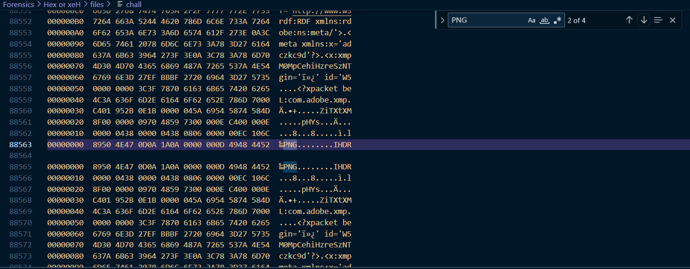

# Hex or xeH

**Description**: Fragments of images are scattered, some reversed and hidden. Reassemble them to reveal the true form of the Marauder's Map and uncover the secret message within.

**File 1**: [chall](./files/chall)

## Solution
### Step 1: This chall file has the hexdump of `4 PNG` file. Search `PNG` and you can see 4 occurance of `PNG`.



### Also we can see that hexdump of PNG 2nd and 4th are reversed

### Step 2: Write a script to extract the PNG files from the hexdump and make sure to reverse the 2nd and 4th PNG hexdumps.

## Script:
```
# Define the input file path
input_file = "chall"  # Replace with your actual filename

# Define the output filenames and their line ranges
output_files = {
    "hex1stpng.txt": (1, 35514),
    "hex2ndpng.txt": (35516, 88561),
    "hex3rdpng.txt": (88563, 159107),
    "hex4thpng.txt": (159110, 226674)
}

# Read file using 'latin-1' encoding to avoid decode errors
with open(input_file, "r", encoding="latin-1") as f:
    lines = f.readlines()

# Process and write to individual files
for filename, (start, end) in output_files.items():
    segment = lines[start - 1:end]
    
    # Reverse content for reversed files
    if "2nd" in filename or "4th" in filename:
        segment = segment[::-1]
    
    with open(filename, "w", encoding="latin-1") as out:
        out.writelines(segment)
print("✅ Hex segments saved successfully.")
```
### Step 3: Combine the parts of the PNG image and extract the flag.

# Flag:
```
KJSSE_CTF{4-PNGs_R3vEr53d_&_M3rg3d_T0_R3v34l_Th3_FL4G}
```