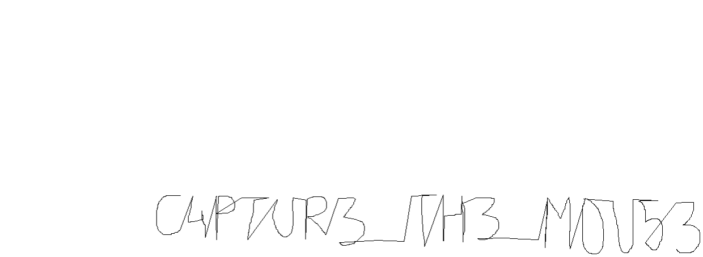

# Invisible Ink

**Description**: A bewitched quill has scribbled an invisible message. Follow the cryptic coordinates to reveal the handwritten flag.

**File 1**: [chall.txt](./files/chall.txt)

## Solution
### Step 1: The content given in the `chall.txt` file are mouse coordinates (X,Y) so the task is to plot those coordinates and get the flag.

### Step 2: Use this script to automate the drawing process in MS Paint and save the image.

## Script:
```
import pyautogui
import time
import os

# Load coordinates
with open("chall.txt", "r") as f:
    coords = [tuple(map(int, line.strip().split(','))) for line in f if ',' in line]

# Instructions
print("Open MS Paint and hover where the drawing should start.")
input("Press Enter when ready (you have 5 seconds to switch to MS Paint)...")

# Wait before execution
time.sleep(5)

# Get starting position
start_x, start_y = pyautogui.position()
print(f"Drawing at offset: {start_x}, {start_y}")

# Adjust coordinates to relative starting point
base_x, base_y = coords[0]
adjusted_coords = [(start_x + x - base_x, start_y + y - base_y) for x, y in coords]

# Start drawing using dragTo for smooth paint strokes
pyautogui.mouseDown()
for x, y in adjusted_coords:
    pyautogui.dragTo(x, y, duration=0, button='left')  # no delay for speed
pyautogui.mouseUp()

print("Drawing complete. Saving the file...")

# Trigger Save As -> PNG using keyboard shortcuts
pyautogui.hotkey('alt', 'f')   # Open File menu
time.sleep(0.5)
pyautogui.press('a')           # Choose 'Save As'
time.sleep(0.5)
pyautogui.press('down', presses=3)  # Move to PNG option (usually 3 times)
pyautogui.press('enter')       # Select PNG
time.sleep(1)

# Save path
save_path = os.path.join(os.path.expanduser('~'), 'Desktop', 'out.png')
pyautogui.write(save_path)
pyautogui.press('enter')       # Confirm save

print(f"Image saved as {save_path}")

```
## Extracted Image: 




# Flag:
```
KJSSE_CTF{C4PTUR3_TH3_M0U53}
```