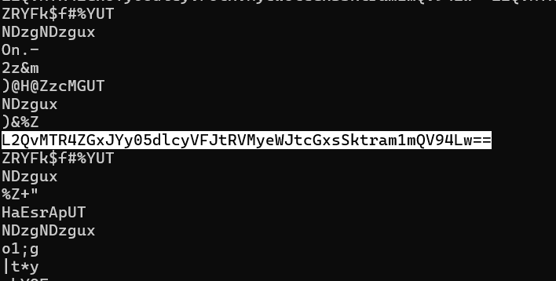
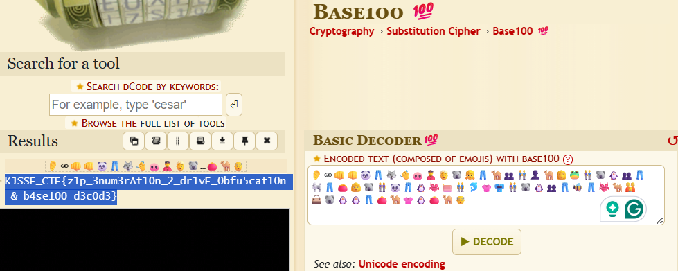

# Packaged Mystery

**Description**: A sea of files conceals a single clue - will you extract the truth or get lost in the compression
  
**File 1**: [Packages_Mystery.zip](./files/Packaged_Mystery.zip)  

## Solution
### Step 1: Extract the zip file, you will get `300` more zips in the folder.

### Step 2: Now the task to get the further hint or the flag from the appropriate zip file.
### Command:
```
string *
```
### This command will give you the string from all the files in the folder.

### Now, using `ctrl + f` search for the keyword such as `flag`, `kjsse`, `==`(for base64 strings) etc.



### Step 3: After converting this to plain text from base64, you will get a half google drive link, append it to `https://drive.google.com/file/` and open it in the browser.
link:
```
https://drive.google.com/file/d/14xdlIc-9vW2TRmES2ybmpllJKkjmfA_x
```

### Step 4: On this link you can see a file named flag.txt which is full of emojis, it is `BASE100`. Decode it using [BASE100](https://www.dcode.fr/code-base100-emoji) Twice and you will get the flag.



# Flag:
```
KJSSE_CTF{z1p_3num3rAt10n_2_dr1vE_0bfu5cat10n_&_b4se100_d3c0d3}