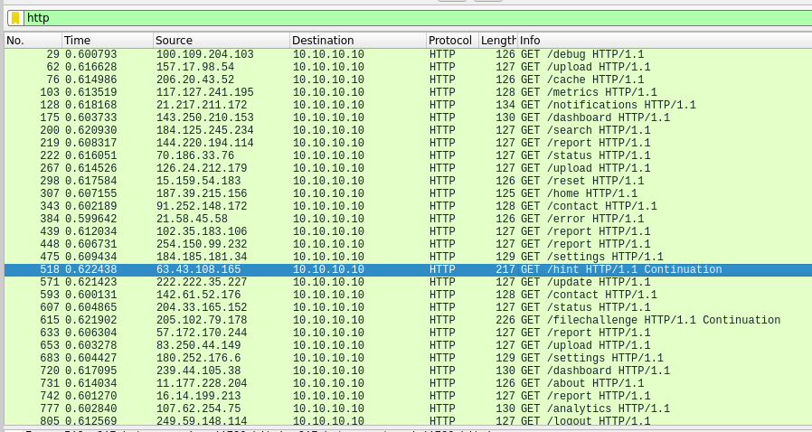
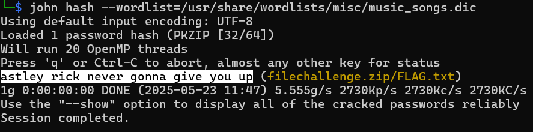

# The Secret Tune

**Description**: A hidden melody flows through the network.

**File 1**: [challenge_traffic.pcap](./files/challenge_traffic.pcap)

## Solution
### Step 1: Use [Wireshark](https://www.wireshark.org/) to analyze the pcap file and add http filter to see all the http packets.



### Step 2: There are packet with request names `/hint` and `/filechallenge`, Both of the packets consists of a drive link, upon them, you will get a file `hint.txt` and challenge file named `filechallenge.zip`.
## content of `hint.txt`:
```
Meet Ryan, a devoted music enthusiast who finds meaning in every melody. His love for songs is so profound that he even named his playlist "Music Words." Could his favorite tracks from this playlist hold the key to unlocking his secrets?
```
### Step 3: Use wordlistctl to fetch a custom wordlist named `music_songs` from the given hint. The wordlist is a collection of song names, artists, and albums.

### Command:
```
sudo python3 wordlistctl.py fetch music_songs
```

### Step 4: Using the custom wordlist, crack the password of `filechallenge.zip`



### Cracked Password
```
astley rick never gonna give you up
```

# Flag:
```
KJSSE_CTF{r1ckr0ll3d_h3lp3d_ctf_pl4y3r}
```