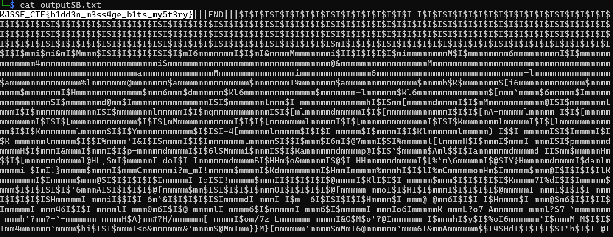

# Why always LSB

**Description**: Why always LSB

**File 1**: [chall.png](./files/chall.png)

## Solution
### Step 1: Use [Sigbits](https://github.com/Pulho/sigBits) to extract the MSB from the chall.png file.

### Command:
```
python3 sigbits.py -t=msb chall.png
```
### You will get a file named `OutputSB.txt` consisting of the MSB and the flag.



# Flag:
```
KJSSE_CTF{h1dd3n_m3ss4ge_b1ts_my5t3ry}
```