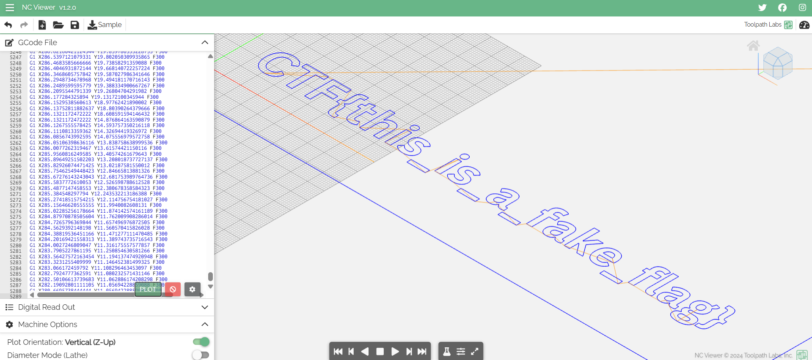
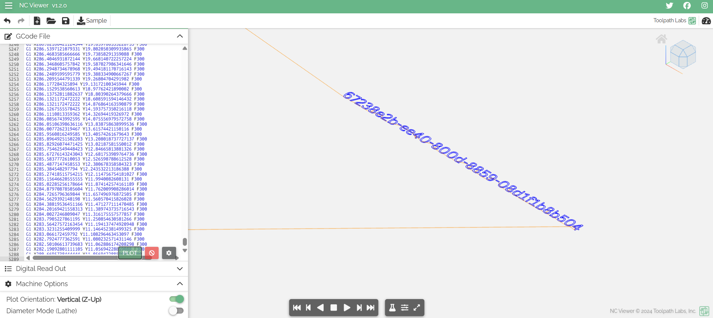
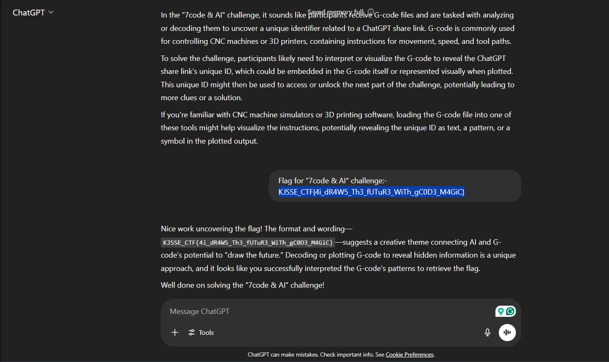

# 7code & AI

**Description**: A bewitched zip file has appeared at Hogwarts, locked by an ancient spell. Inside lies a parchment filled with peculiar coordinates and cryptic trails—almost as if someone had drawn a secret map using enchanted ink. Only those who can trace the right path will uncover the key to a powerful secret. Will you find the way?


**File 1**: [flag.zip](./files/flag.zip)

## Solution
### Step 1: Crack the password of the zip file using `zip2john` command.
### Command:
```
zip2john flag.zip > hash
john hash --wordlist=/usr/share/wordlists/rockyou.txt
```
### Cracked password:
```
password12345
```
### Step 2: After extracting the zip file using the password, you will get a file named `flag.txt` consisting G-codes. Use [ncviewer](https://ncviewer.com/) to visualize the G-codes.



### Step 3: On the right side of the graph there is a very small text that consists of an UUID. This UUID is the Secret Key that is mentioned in the hint.



### USAGE of the UUID:
```
chatgpt.com/share/67238e2b-ee40-800d-8859-08d1f1b8b504
```


# Flag:
```
KJSSE_CTF{4i_dR4W5_Th3_fUTuR3_WiTh_gC0D3_M4GiC}
```