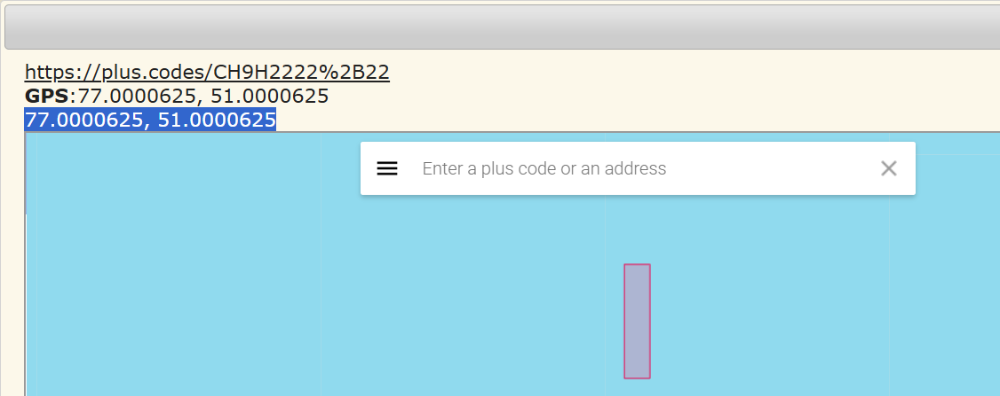

# Dark Mark Codes

**Description**: The Dark Mark has appeared. Decode the cryptic codes to uncover the hidden secrets of the wizarding world.

**File 1**: [chall.txt](./files/chall.txt)

## Solution
### Step 1: Using [Open Location Code Decoder](https://www.dcode.fr/open-location-code) to get the coordinates from the from the provided `Plus Codes`.



### Similarly, decode the other codes as well.
```
Coordinate 1:- 77.0000625, 51.0000625
Coordinate 2:- 83.0000625, 83.0000625
Coordinate 3:- 73.0000625, 67.000187
Coordinate 4:- 79.0000625, 48.0000625
Coordinate 5:- 82.0000625, 68.0000625
```
### Step 2: Consider the numbers before the decimal point as `ASCII` numbers and convert them to characters to get the `flag`.


### Decoded String:
```
M3SSICO0RD
```

# Flag:
```
KJSSE_CTF{M3SSICO0RD}
```