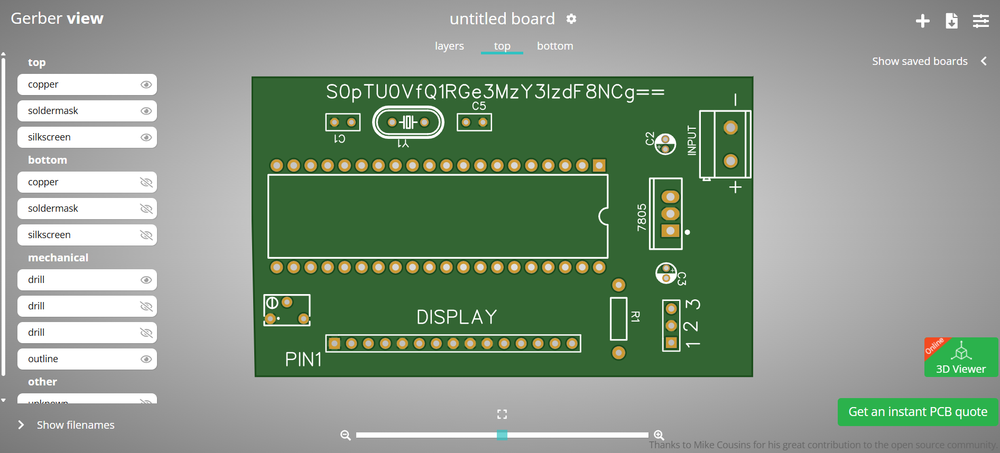
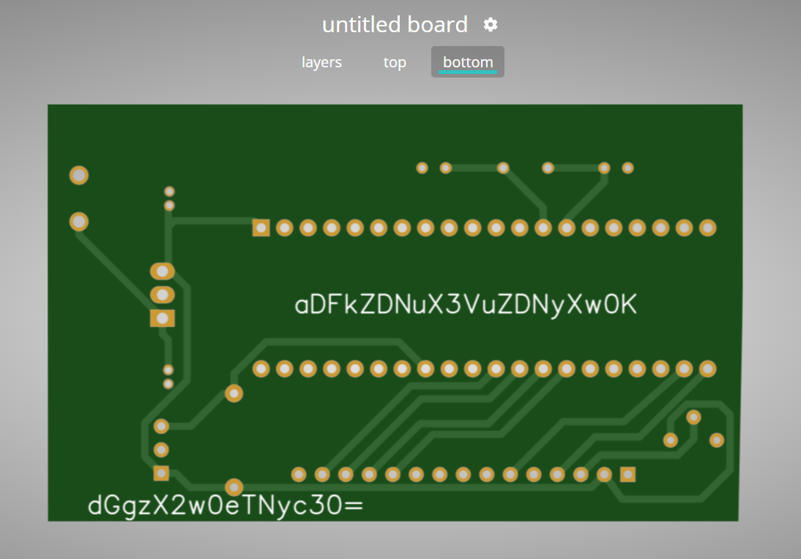

# Etch & Extract

**Description**: Etched within the files lies a hidden secret - will you be able to extract it?

**Files**: [etcher.zip](./files/etcher.zip)

# Solution
### Step 1: Without extracting the zip file, upload it to [Online Gerber Viewer](https://www.pcbway.com/project/OnlineGerberViewer.html).



### Step 2: You will see a PCB layout with some text on it. The text is Base64 encoded.


### Step 3: Decode the Base64 text using [Base64 Decoder](https://www.base64decode.org/).

### Step 4: Turn the PCB layout in various directions to get the other parts of the flag.



### Step 5: The final flag is a combination of all the parts.

Flag:
```
KJSSE_CTF{s3cr3t_h1dd3n_und3r_th3_l4y3rs}
```