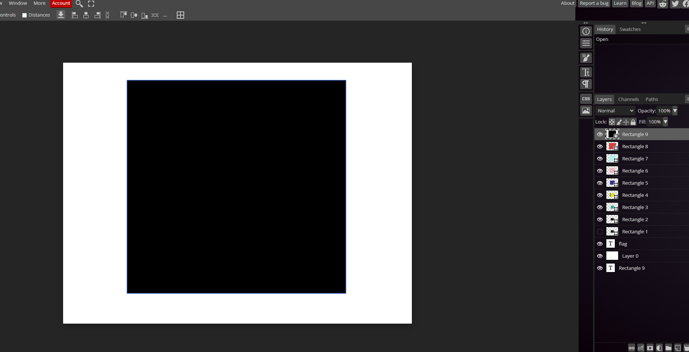
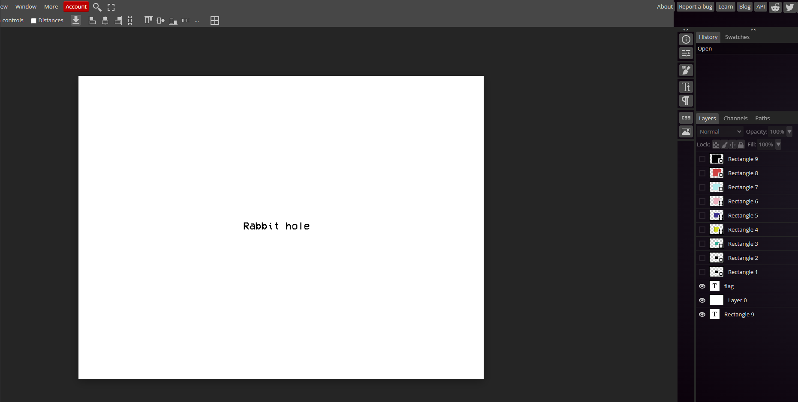
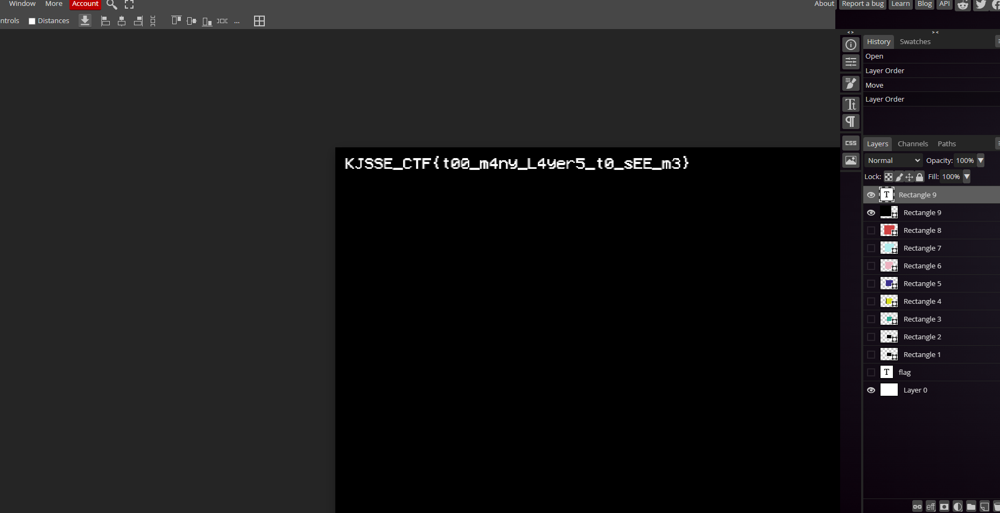

# Hidden Layer Mystery

**Description**: Sometimes the easiest way is the best way, what do you think???

**File**: [Chall.psd](./files/Chall.psd)

## Solution

Loading the `.psd` file in `photopea` we can see various layers.

<figure></figure>

On hiding the box layers, We get the following text.

<figure></figure>

But there is another text layer under `Layer 0`.

<figure></figure>

## Flag
```
KJSSE_CTF{t00_m4ny_L4yer5_t0_sEE_m3}
```