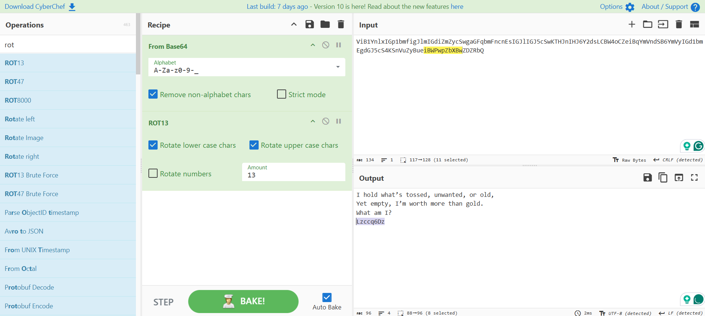
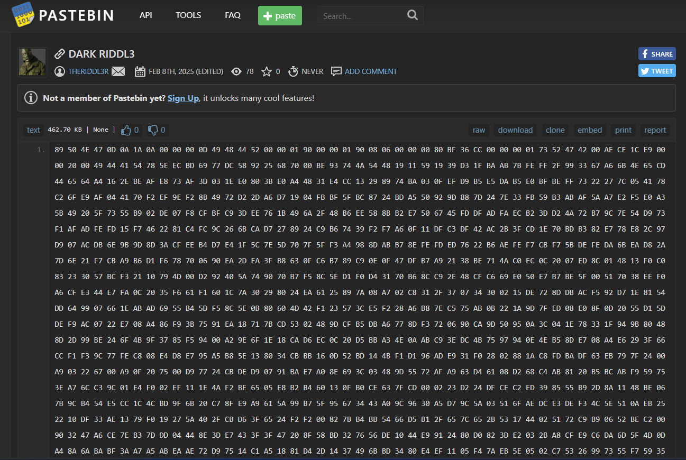
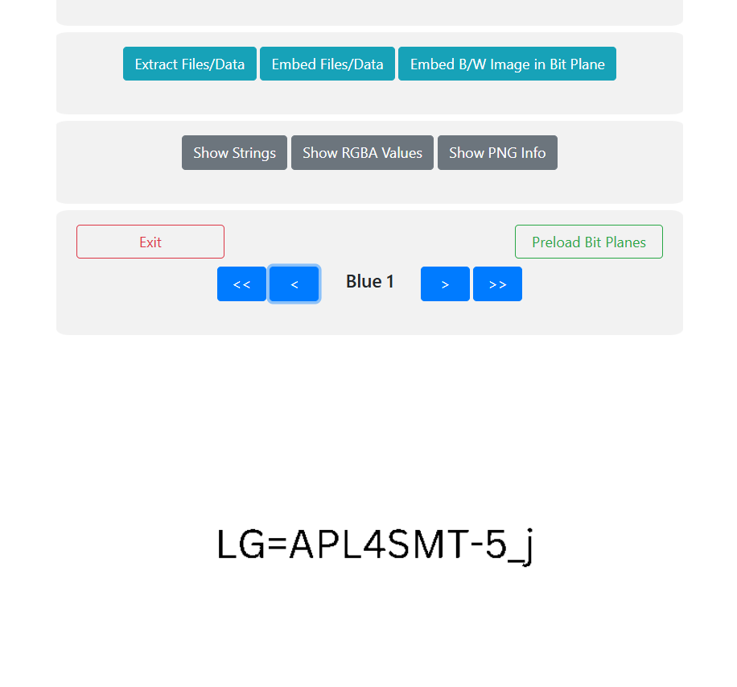
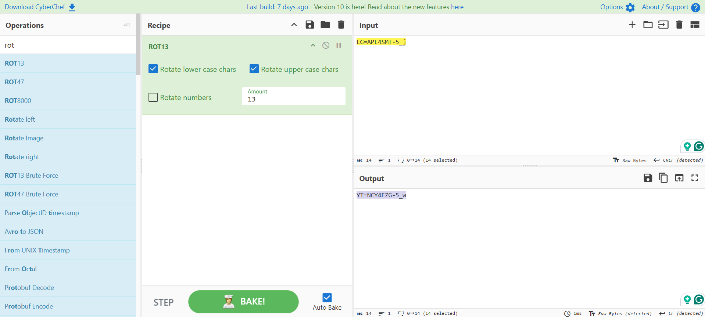
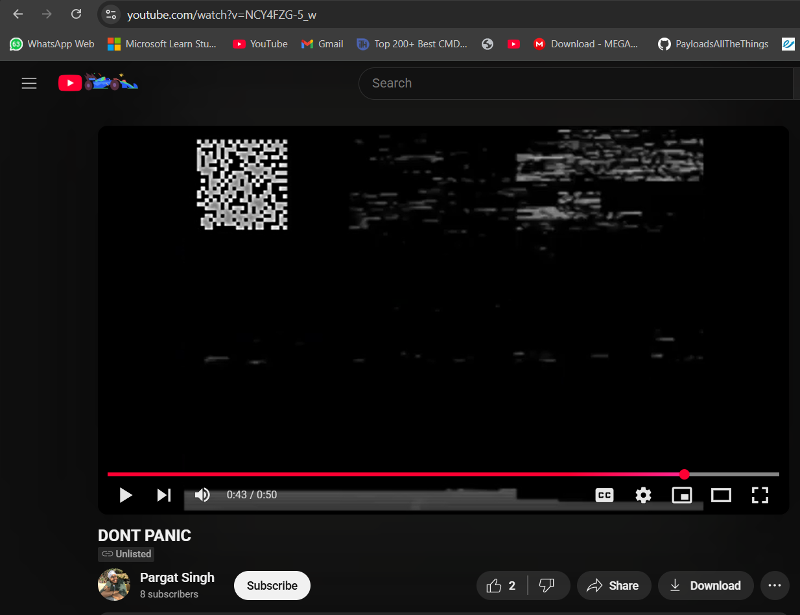
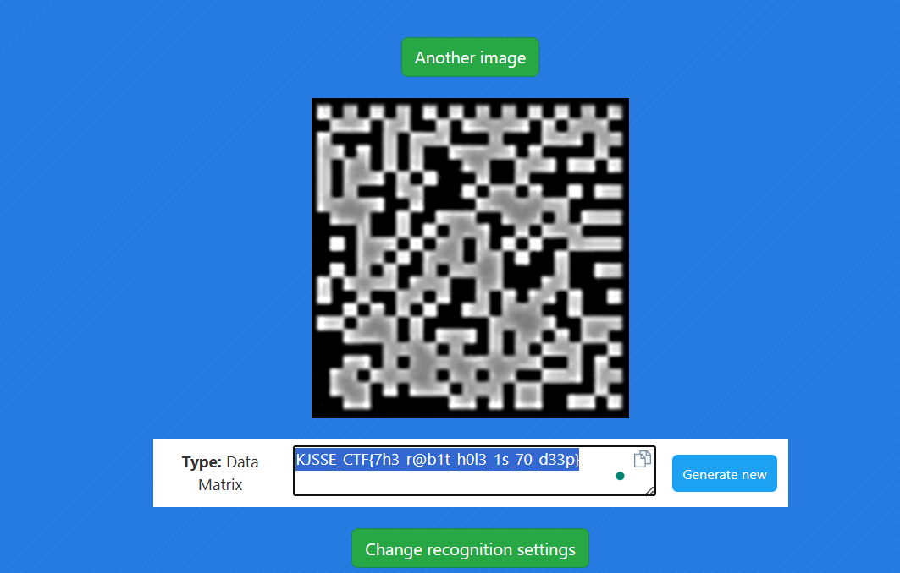

# The Dark Alliance

**Description**: Ah, Potter… you think you’ve faced all my forces, but there are always shadows in the dark. An old friend has returned, a mind as twisted as mine, and together, we shall unravel your fate. The Riddler and I… we’ve made a most intriguing alliance. Prepare yourself, for the puzzles ahead will be your undoing.
ViB1YnlxIGp1bmfigJlmIGdiZmZycSwgaGFqbmFncnEsIGJlIGJ5cSwKTHJnIHJ6Y2dsLCBW4oCZeiBqYmVndSB6YmVyIGd1bmEgdGJ5cS4KSnVuZyBueiBWPwpZbXBwZDZRbQ

## Solution
### Step 1: `Base64 -> ROT13 -> Plain Text`


### `Lzccq6Dz`
### Usage of this string:
```
https://pastebin.com/Lzccq6Dz
```
### Step 2: Upon visiting the link, we get a hex dump.



### Use [CyberChef](https://gchq.github.io/CyberChef/) to get the `PNG`
```
From Hex -> Render Image
```
### Step 3: Browse between `BitPlanes` by using [StegOnline](https://georgeom.net/StegOnline/image)



### Step 4: Use `ROT 13` to decode the string.



Upon decoding the string, we get:
```
YT=NCY4FZG-5_w
```
### This is a `Youtube` link.
### Usage:
```
https://www.youtube.com/watch?v=NCY4FZG-5_w
```
### Step 5: The video contains a `Hidden Data Matrix QR Code`.



### Step 6: Use [Data Matrix Reader](https://products.aspose.app/barcode/recognize/datamatrix#) to read the data matrix.



# Flag:
```
KJSSE_CTF{7h3_r@b1t_h0l3_1s_70_d33p}
```