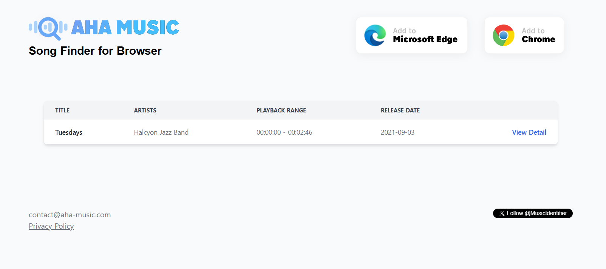

# Ad of Secrets

**Description**: This enchanted melody holds a hidden secret.

Note: Remove special characters like "!@#$%^&*(),./<>?;:'" from the flag.

Flag format: KJSSE_CTF{<Name_of_the_song>+<Name of the artist/Band>}

Example:-
Song name = Hamari Adhuri Kahani
Artist name = Arijit Singh

Flag:- KJSSE_CTF{Hamari_Adhuri_Kahani_Arijit_Singh}

**File 1**: [Chall.mp3](./files/Chall.mp3)

## Solution
### Step 1: Use [Audio Reverse](https://audioalter.com/reverse) to reverse the audio.

### Step 2: Use Google song recognition, Shazam(Apple) or [aha-music](https://aha-music.com/) to identify the song.



# Flag:
```
KJSSE_CTF{Tuesdays_Halcyon_Jazz_Band}
```