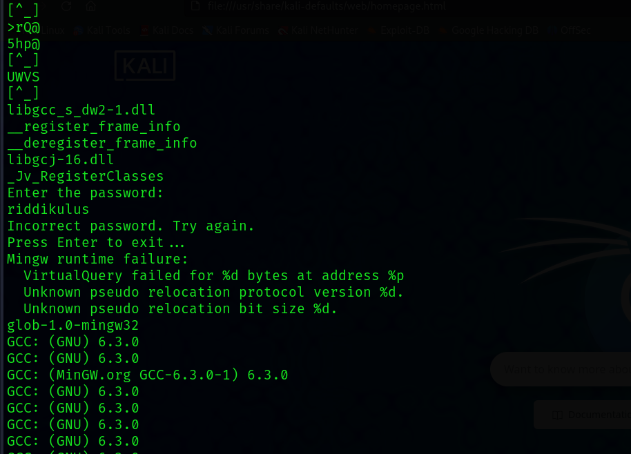
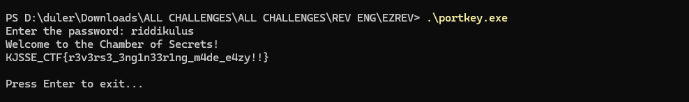

# EZREV

**Files**: [portkey.exe](./files/portkey.exe)

## Solution

On using `strings` on the source file, we find the password needed to run the file.

<figure></figure>

Enter the password while executing the file.

<figure></figure>

Flag:
```
KJSSE_CTF{r3v3rs3_3ng1n33r1ng_m4de_e4zy!!}
```