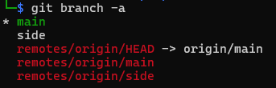
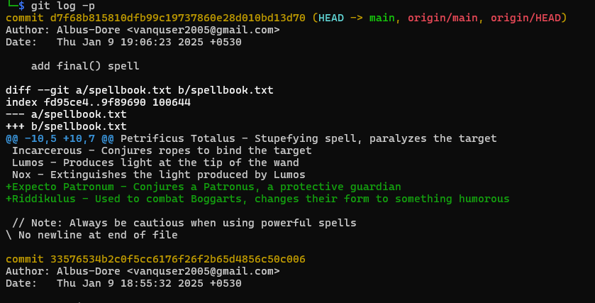
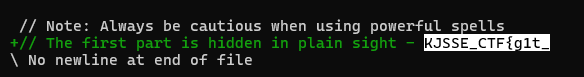
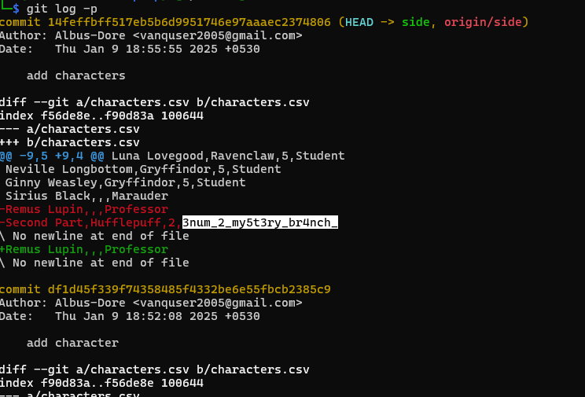
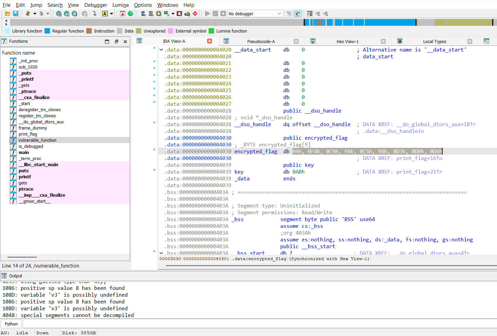
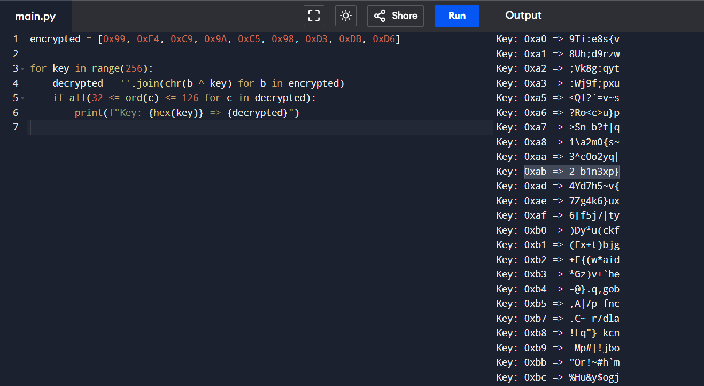

# GitGud

**Description**: Mysterious traces of an ancient spell lie hidden across timelines. Unravel the past, piece them together, and uncover the lost incantation before it's too late.

**File 1**: [GitGud.zip](./files/GitGud.zip)

## Solution
### Step 1: Upon extracting the `GitGud.zip` file, we get a folder which has multiple files including a `.git` folder

### Step 2: Check for branches. 
### Command:
```
git branch -a
```


### Step 3: There are 2 branches, `main` and `side`, so first lets start with `main` branch.
### Command: 
```
git log -p
```


### This command will show the commit history along with the changes made in each commit.

### Part 1 of the flag is `KJSSE_CTF{g1t_`


### Step 4: Now switch to `side` branch.
### Command:
```
git checkout side
```
### Step 5: Check the commit history of `side` branch.
### Command:
```
git log -p
```


### Part 2 of the flag is `3num_2_my5t3ry_br4nch_`

### Step 6: Now for the 3rd part of the flag, we need to check the `.git` folder, you will get a binary file named program, Reverse it using decompilers like Ghidra or IDA.



### Step 7: Decrypt the flag into plain text, This is XOR operation, so we need to find the key by brute forcing the key.
### Script:
```
encrypted = [0x99, 0xF4, 0xC9, 0x9A, 0xC5, 0x98, 0xD3, 0xDB, 0xD6]

for key in range(256):
    decrypted = ''.join(chr(b ^ key) for b in encrypted)
    if all(32 <= ord(c) <= 126 for c in decrypted):
        print(f"Key: {hex(key)} => {decrypted}")
```

### Output:
```
Key: 0xab => 2_b1n3xp}
```

# Flag:
```
KJSSE_CTF{g1t_3num_2_my5t3ry_br4nch_2_b1n3xp}
```