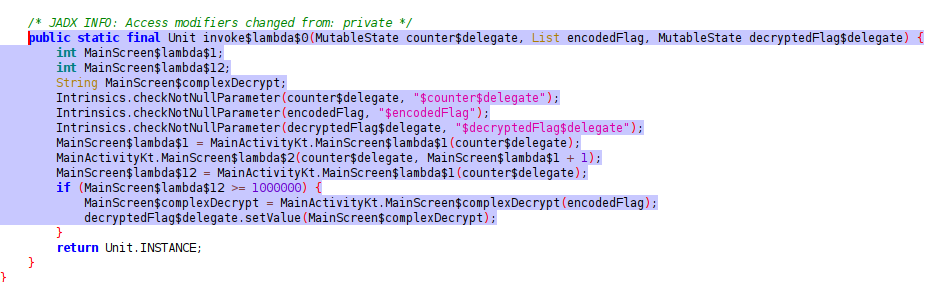

# Infinite Persistence

**Description**: A million actions separate you from the truth, but perhaps magic can alter fate.

**File 1**: [app-release.apk](./files/app-release.apk)

## Solution

### Step 1: Upon installing the `APK` file, it says that to get the flag, you need to perform a million clicks on the button. You can either do it manually 😂 or automate the process using a script😎.

### But a better method is to reverse engineer the `APK` file and change the rules :)

### Step 1: Use `apktool`, `jadx-gui` or any other tool to decompile the `APK` file.

### Step 2: This function is responsible for checking the number of clicks and returning the flag if the number of clicks is greater than or equal to 1000000.



### Step 3: Change the condition to return the flag without clicking the button a million times and recompile the `APK` file.

### (Use Android Studio or `apktool` to recompile the APK file)


### Step 4: Install the modified `APK` file and open it. You will see the flag.

# Flag:
```
KJSSE_CTF{WASITEASY}
```