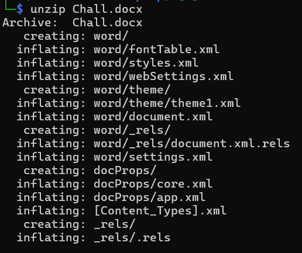
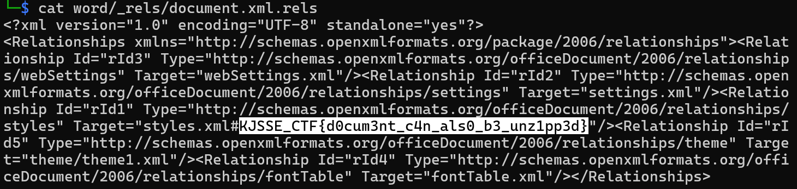

# A simple document

**Description**: Just a normal document, nothing unusual…right?

**File 1**: [Chall.docx](./files/Chall.docx)

## Solution
### Step 1: Extract the `Chall.docx` file
### Command:
```
unzip Chall.docx
```


### Step 2: Use `grep` to find the keywords related to the flag.
### Command:
```
grep -Ro "KJSSE_CTF""
```




# Flag:
```
KJSSE_CTF{d0cum3nt_c4n_als0_b3_unz1pp3d}
```