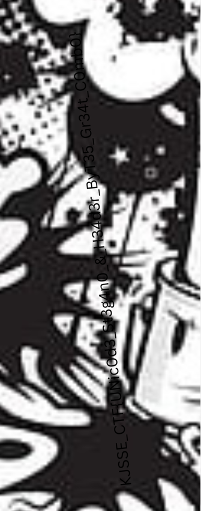

# Mischief Encoded

**Description**: A bewitched archive guards a hidden secret—only those who decipher the unseen and mend the broken shall uncover its mystery.

**File 1**: [Hidden_Password.txt](./files/Hidden_Password.txt)<br>
**File 2**: [Stegano_Flag.zip](./files/Stegano_Flag.zip)

## Solution

### Step 1:- Extracting the hidden password from [Hidden_Password.txt](./files/Hidden_Password.txt) using [Unicode Steganography](https://330k.github.io/misc_tools/unicode_steganography.html).


### Step 2:- Upon extracting [Stegano_Flag.zip](./files/Stegano_Flag.zip) using the password `KJ553_C0D3C3LL`, we get a corrupt image with incorrect header.


```
Correct Header: 89 50 4E 47 0D 0A 1A 0A 00 00 00 0D 49 48 44 52
```


### Step 3:- The flag is at the bottom-right side of the image.


# Flag:
```
KJSSE_CTF{UNic0d3_St3g4n0_&_H34d3r_ByT35_Gr34t_C0mb0}
```