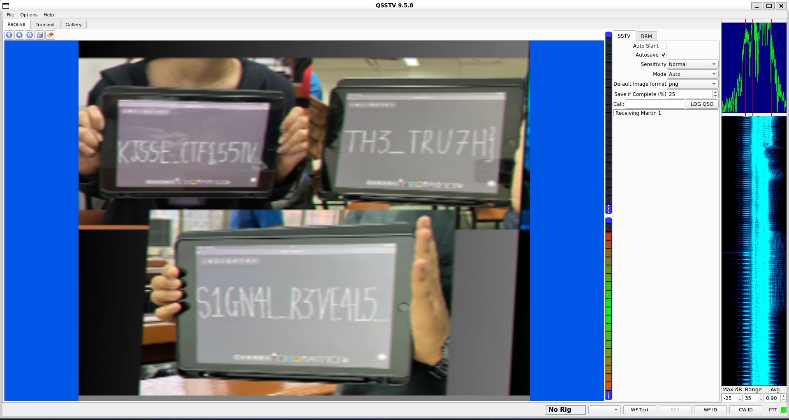

# TORTURE

**File 1**: [Chall.wav](./files/Chall.wav)

## Solution
### Step 1: The Chall.wav file provided consists of `SSTV` Signals. Use `qsstv` to generate the signals to the image.
### Command:
```
qsstv
```
### Upload the `Chall.wav` file and it will start generating the image.



# Flag:
```
KJSSE_CTF{55TV_S1GN4L_R3VE4L5_TH3_TRU7H}
```