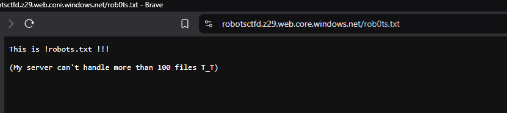
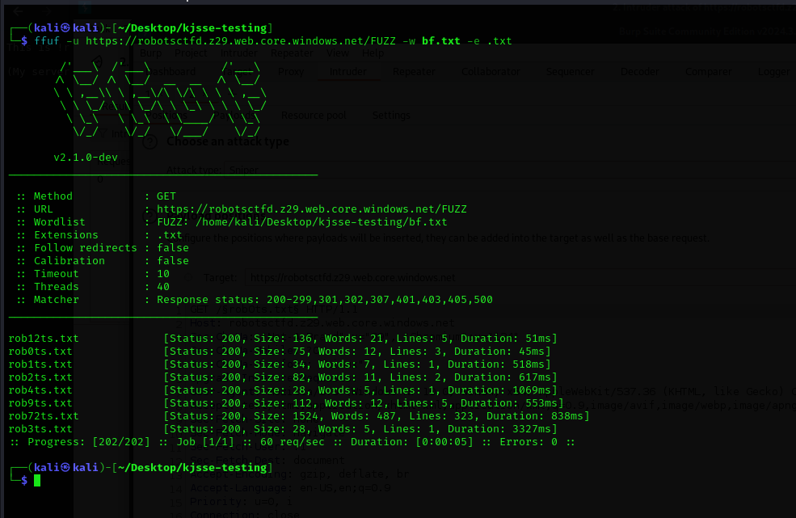

# Robots.txt or Rob0ts.txt

**Description**: A secret record lies hidden within Hogwarts, concealed by an invisibility charm. Only those who explore the right paths can unveil it. Seek the hidden passage and reveal what’s concealed beyond the magic.

**Link**: `https://robotsctfd.z29.web.core.windows.net/`

## Solution

`robots.txt` doesn't open anything but on `rob0ts.txt` we see this.

<figure></figure>

So we bruteforce the directories from 1 to 100 considering the numbers go at `rob(N)ts.txt`.

```python
with open("bf.txt", "w") as file:
    for n in range(101):
        filename = f"rob{n}ts.txt"
        file.write(filename + "\n")  

print("Done!")
```

<figure></figure>

`rob72ts.txt` has a lot of lines so let's check that out.

It looks like an empty file but when we select all of the contents, there is whitespace in the file.<br>

It can be decoded using the [Whitespace decoder](https://www.dcode.fr/whitespace-language)


Flag:
```
KJSSE_CTF{FInDiNg_Th3_FiL3_R3m0vInG_th3_Invi5ibiLitY_CL04k}
```