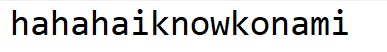
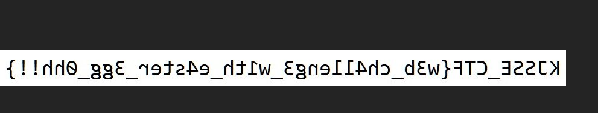
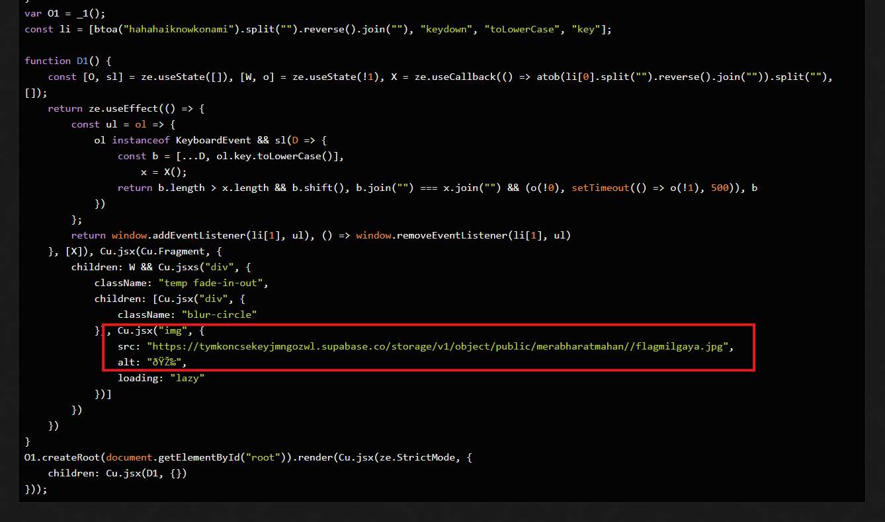

# The Vanishing Spell

**Description**: Uncover the hidden message and invoke an ancient spell to reveal the flag

**Link 1**: `https://gist.github.com/amandeeep02/9e8f35f0fb0173ddf1486e7f377fc7a5`

**Link 2**: `https://konami.kjsse.com`

## Solution

On the gist link, there is a `supabase` storage link with the name of the file.

`https://tymkoncsekeyjmngozwl.supabase.co/storage/v1/object/public/ctfd/konami.jpg`

The image that we get using this link is just a text.

<figure></figure>

## Intended Solution

Looking up konami easter egg on the web pretty much solves the challenge.

When we type `hahahaiknowkonami` we get the flag in a flipped way.

<figure></figure>

## Unintended Solution

On pasting the minified js to `d4js` we can find another `supabase` storage link with the flag.

<figure></figure>

Which loads up the same image.

Flag:
```
KJSSE_CTF{w3b_ch4lleng3_w1th_e4ster_3gg_0hh!!}
```